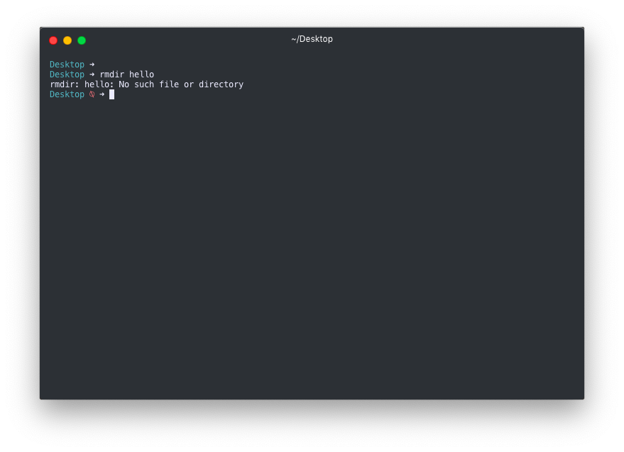
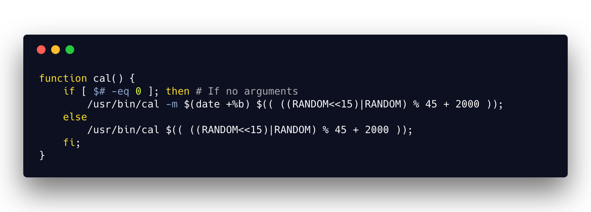

# Pranks
Here is a list of all my favourite \*nix & Windows pranks.

Table of Contents
- [1. Change ssh to shh](#1-change-ssh-to-shh)
- [2. Create a `~` folder](#2-create-a--folder)
- [3. Slow down the terminal](#3-slow-down-the-terminal)
- [4. File names that end with spaces](#4-file-names-that-end-with-spaces)
- [5. Ssshhh! - macOS only](#5-ssshhh---macos-only)
- [6. Upside down Windows - Windows Only](#6-upside-down-windows)
- [7. Change Editors!](#7-change-editors)
- [8. Install sl](#8-install-sl)
- [9. Make `date` return random dates](#9-make-date-return-random-dates)

## 1. Change ssh to shh
<!--  -->
 
```
mv ~/.ssh ~/.shh
```
From this: https://twitter.com/nixcraft/status/1045760653510815744

## 2. Create a `~` folder
**Note**: Potentially destructive. Use caution.
<!--  -->
 

```
mkdir '~'
echo "kghkjhlkjh" > ./'~'/1
```
While `~` is an alias for `$HOME` folder, file/folder names with `~` are perfectly legal. Put some random stuff in it so that user has to use `rm -rf ` to delete the folder.

Now, invariably, the victim types `rm -rf ~` to delete the folder. :smiling_imp:

If you want to be sure the user notices it, add this line to `~/.bashrc`.  

<!--  -->
 

```
alias cd="mkdir -p '~' && echo "kghkjhlkjh" > ./'~'/1 && cd"
```
Now every directory the user `cd`s into will have a `~` folder.

## 3. Slow down the terminal

 
<!--  -->

```
echo "echo 'sleep .1' >> ~/.bashrc" >> ~/.bashrc
```

So a `sleep .1` is added to `~/.bashrc` everytime the user starts a new terminal. So the terminal startup time increases with every use, slowly, but surely.

## 4. File names that end with spaces

 
<!--  -->

```
mv ~/.ssh ~/'.ssh '
```
```
mkdir ~/Desktop/'hello '
```
And so on.

File names with trailing spaces are perfectly legal. Watch them struggle deleting it :laughing:



## 5. Ssshhh! - macOS only

In `settings > accessibility > Speech > System voice > customise`, download voice `whisper`.  

Now, add this to `~/.bashprofile`

  
<!--    -->

```
alias ssh="osascript -e 'set volume 10' && say -v whisper shh && ssh"
```

## 6. Upside down Windows

Every one knows that `ctrl + shift + down-arrow` inverts the desktop. Instead, 

* Take a screenshot of the normal Desktop, invert it horizontally and vertically in paint. 
* Then disable icons and auto hide the taskbar.
* Set the previous inverted image as Wallpaper.
* optional: Invert mouse and arrow keys from settings
* Now invert the Desktop!

## 7. Change Editors!

Modify the `.bashrc` to include this:  

  

```
alias nano="/usr/bin/vi"
alias vi="/usr/bin/nano"
alias vim="/usr/bin/emacs"
alias emacs="/usr/bin/vim"
```

## 8. Install sl

Install sl and leave it be. Everyone is bound to type `sl` instead of `ls` at some point of time.

https://www.youtube.com/watch?v=9GyMZKWjcYU

## 9. Make `date` return random dates

This might need some tweaking in some systems, especially BSD versions of `date` command.  Add these to `.bashrc`.

  

``` sh
 alias date='date -d "now + $RANDOM days"'
```

Similarly, for the `cal` command,

  

``` sh
function cal() {
    if [ $# -eq 0 ]; then # If no arguments
        /usr/bin/cal -m $(date +%b) $(( ((RANDOM<<15)|RANDOM) % 45 + 2000 ));
    else
        /usr/bin/cal $(( ((RANDOM<<15)|RANDOM) % 45 + 2000 ));
    fi;
}
```
